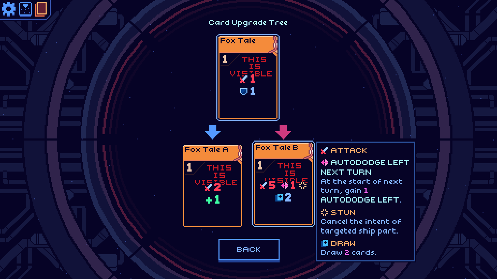

<!--
This README was made using Louis3797's awesome-readme-template
-->
<div align="center">
  <h1>Demo Nickel Mod</h1>
  
  
  <p>
    A demo mod for Cobalt Core 
  </p>
</div>


<!-- Table of Contents -->
# :notebook_with_decorative_cover: Table of Contents

- [About the project](#star2-about-the-project)
  * [What is Demo Mod](#books-what-is-demo-mod)
  * [Features](#dart-features)
  * [Screenshots](#camera-screenshots)
- [Making a mod](#wrench-making-a-mod)
  * [What is Nickel](#question-what-is-nickel)
  * [Prerequisites](#bangbang-prerequisites)
  * [Using Demo Mod as a template](#eyes-using-demo-mod-as-a-template)
  * [Basic files and folders](#file_folder-basic-files-and-folders)
  * [Tips](#bulb-tips)
- [Other mods](gem-other-mods)


<!-- About -->
## :star2: About the project


<!-- What is Demo Mod -->
### :books: What is Demo Mod
Demo Mod is a small, simple mod for Cobalt Core with basic features, created so modders can use it as a starting point.


<!-- Features -->
### :dart: Features

- 1 Character
- 1 Ship
- 2 Cards
- 2 Artifacts
- 1 Status


<!-- Screenshots -->
### :camera: Screenshots

<div align="center"> 
  
  
</div>


<!-- Making a Mod -->
## 	:wrench: Making a Mod


<!-- What is Nickel -->
### :question: What is Nickel
[Nickel](https://github.com/Shockah/Nickel/releases) is a mod loader for Cobalt Core developed by Shockah.
It allows the community to play and create mods with ease.
You will want to have Nickel downloaded in your machine before you start modding using this template.


<!-- Prerequisites -->
### :bangbang: Prerequisites
You will want to compile C#, and so it is recommended to use an IDE or similar.
There are many out there, but if you're new to modding, we recommend [Visual Studio Community](https://visualstudio.microsoft.com/vs/getting-started/).
_If you want to use VS, then make sure to check the '.NET desktop development' box during installation._

You are expected to know a bit of C#, or, in the case you're just starting, a desire for learning.

<!-- Using Demo Mod as a template-->
### :eyes: Using Demo Mod as a template
You can download this repository and start modding right away.


<!-- Basic files and folders -->
### :file_folder: Basic files and folders
`nickel.json` is used by Nickel to identify a mod's .dll file, it contains relevant info such as mod version and potential dependencies.
Here are some examples:
##### Shockah's Dracula mod
```json
{
    "UniqueName": "Shockah.Dracula",
    "Version": "1.0.2",
    "RequiredApiVersion": "0.5.0",
    "EntryPointAssembly": "Dracula.dll",
    "LoadPhase": "AfterDbInit",
    "Dependencies": [
        {
            "UniqueName": "Shockah.Kokoro",
            "Version": "1.3.1"
        },
        {
            "UniqueName": "TheJazMaster.MoreDifficulties",
            "Version": "1.3.0",
            "IsRequired": false
        }
    ]
}
```
##### Arin's Randall mod
```json
{
    "UniqueName": "Arin.Randall",
    "Version": "0.9.2",
    "RequiredApiVersion": "0.4.2",
    "EntryPointAssembly": "RandallMod.dll",
    "Dependencies": [
        {
            "UniqueName": "Shockah.Kokoro",
            "Version": "1.2.0"
        },
        {
            "UniqueName": "TheJazMaster.MoreDifficulties",
            "Version": "1.3.0",
            "IsRequired": false
        }
    ],
    "LoadPhase": "AfterDbInit"
}
```
##### KBraid's Braid and Eili mod
```json
{
  "UniqueName": "KBraid.BraidEili",
  "Version": "0.7.2",
  "RequiredApiVersion": "0.6.0",
  "EntryPointAssembly": "BraidEili.dll",
  "LoadPhase": "AfterDbInit",
  "Dependencies": [
    {
      "UniqueName": "Shockah.Kokoro",
      "Version": "1.3.1"
    }
  ]
}
```
##### Sorwest's DemoMod mod (aka, this one)
```json
{
  "UniqueName": "AuthorName.DemoMod",
  "Version": "1.3.0",
  "Author": "Author",
  "Description": "2 cards, 2 artifacts, 1 ship, 1 status. Use to learn!",
  "RequiredApiVersion": "0.6.0",
  "EntryPointAssembly": "DemoMod.dll",
  "Dependencies": [
    {
      "UniqueName": "Shockah.Kokoro",
      "Version": "1.3.1"
    }
  ]
}
```
`.csproj` encapsulates the project's settings and configuration.
If you need to manually feed the mod loader path to your project, ìn the same top folder as your `.csproj`, you can create the file `Configuration.props.user` with the following: (And you can modify the path to your modloader location)
```xml
<Project>
  <PropertyGroup>
    <ModLoaderPath>/PATH/TO/NICKEL/BINARIES/</ModLoaderPath>
  </PropertyGroup>
</Project>
```
In case you do anything weird, here's a copy of the original .csproj file contents.
```xml
<Project Sdk="Microsoft.NET.Sdk">
  <PropertyGroup>
    <RootNamespace>AuthorName.DemoMod</RootNamespace>
    <Version>1.3.0</Version>
    <IsNickelMod>True</IsNickelMod>
    <IncludedModProjectPaths>i18n;assets</IncludedModProjectPaths>
    <LangVersion>12.0</LangVersion>
    <TargetFramework>net8.0</TargetFramework>
    <ImplicitUsings>disable</ImplicitUsings>
    <Nullable>enable</Nullable>
    <WarningsAsErrors>Nullable</WarningsAsErrors>
    <CheckEolTargetFramework>false</CheckEolTargetFramework>
    <ModZipPath>$(MSBuildProjectDirectory)\.release\$(MSBuildProjectName)-$(Version).zip</ModZipPath>
  </PropertyGroup>
  <ItemGroup>
    <PackageReference Include="Nickel.ModBuildConfig" Version="0.4.0" />
  </ItemGroup>
  <ItemGroup>
    <Project Include="Configuration.props.user" Condition="Exists('Configuration.props.user')" />
  </ItemGroup>
</Project>
```


<!-- Tips -->
### :bulb: Tips
#### Vanilla card count

| CREW MEMBER | # COMMON | # UNCOMMON | # RARE |
|-------------|----------|------------|--------|
|  DIZZY | 9 | 7 | 5
|  RIGGS | 9 | 7 | 5
|  PERI | 12 | 7 | 5
|  ISAAC | 10 | 7 | 5
|  DRAKE | 9 | 7 | 5
|  MAX | 10 | 7 | 5
|  BOOKS | 11 | 7 | 5 
|  CAT | 12 | 7 | 4 

#### Vanilla artifact count

| CREW MEMBER | # COMMON | # BOSS |
|-------------|----------|--------|
|  DIZZY | 4 | 2
|  RIGGS | 3 | 2
|  PERI | 3 | 2
|  ISAAC | 4 | 2
|  DRAKE | 5 | 1
|  MAX | 4 | 3
|  BOOKS | 5 | 1
|  CAT | 3 | 1

<!-- Other mods -->
## :gem: Other mods
- [Shockah's Dracula mod](https://github.com/Shockah/Cobalt-Core-Mods/tree/dev/dracula)
- [Arin's Randall mod](https://github.com/UnicornArin/CobaltCoreRandall)
- [KBraid's Braid and Eili mod](https://github.com/KBraid/cobalt-core-mods/tree/main/Braid%20and%20Eili)
